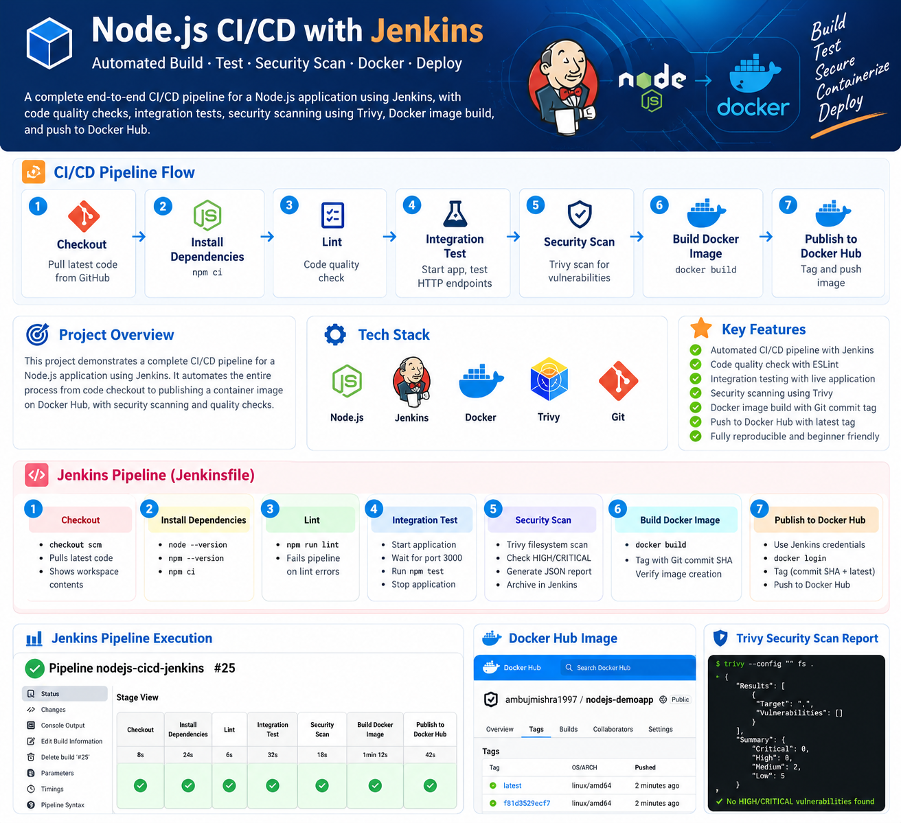

# Node.js CI/CD Pipeline with Jenkins

A hands-on **CI/CD + DevSecOps project** that implements an end-to-end pipeline for a Node.js web application using **Jenkins, Trivy, Docker, Docker Hub, Git, and GitHub**.

The application source is based on the open-source `benc-uk/nodejs-demoapp` project. My work in this repository focuses on Jenkins automation around the application: source checkout, dependency installation, linting, integration testing, vulnerability scanning, Docker image creation, secure credential handling, and publishing to Docker Hub.

<p align="center">
  
</p>

---

## Project Overview

This project demonstrates how a Node.js application can be validated, secured, containerized, and published using a Jenkins Declarative Pipeline.

```text
GitHub Repository
       ↓
Jenkins Poll SCM
       ↓
Checkout
       ↓
Install Dependencies
       ↓
Lint
       ↓
Integration Test
       ↓
Trivy Security Scan
       ↓
Build Docker Image
       ↓
Publish to Docker Hub
```

Each stage acts as a quality gate. If a required stage fails, the remaining stages do not continue.

---

## Key Features

- Jenkins Declarative Pipeline using a `Jenkinsfile`
- Automatic source-code checkout from GitHub
- Poll SCM trigger for automatic builds
- Reproducible dependency installation using `npm ci`
- ESLint-based code-quality validation
- Integration testing against a running Node.js application
- Application readiness check using `curl`
- Trivy vulnerability scanning for HIGH and CRITICAL issues
- Jenkins artifact archiving for the Trivy JSON report
- Docker image creation using a custom `Dockerfile`
- Git commit SHA based Docker image tagging
- Secure Docker Hub authentication through Jenkins Credentials
- Docker image publishing with commit SHA and `latest` tags

---

## CI/CD Pipeline Stages

| Stage | Purpose | Main Command / Tool |
|---|---|---|
| **1. Checkout** | Pull the latest source code from GitHub | `checkout scm` |
| **2. Install Dependencies** | Install exact Node.js dependencies | `npm ci` |
| **3. Lint** | Run code-quality checks | `npm run lint` |
| **4. Integration Test** | Start app, wait for readiness, run tests | `npm start`, `curl`, `npm test` |
| **5. Security Scan** | Scan repository/dependencies for vulnerabilities | Trivy |
| **6. Build Docker Image** | Build a deployable container image | `docker build` |
| **7. Publish to Docker Hub** | Login, tag, and push the image | `docker login`, `docker tag`, `docker push` |

---

## Repository Structure

```text
NODEJS-CICD-JENKINS/
│
├── docs/
│   └── images/
│       └── jenkins-cicd-pipeline-architecture.png
│
├── src/
│   ├── public/
│   ├── routes/
│   ├── tests/
│   ├── todo/
│   ├── views/
│   ├── .env.sample
│   ├── eslint.config.mjs
│   ├── graph.mjs
│   ├── package.json
│   ├── package-lock.json
│   └── server.mjs
│
├── .dockerignore
├── .gitignore
├── .prettierrc.yaml
├── Dockerfile
├── Jenkinsfile
└── README.md
```

---

## Tech Stack

- **Jenkins** — CI/CD automation
- **Node.js 24** — Application runtime
- **npm** — Dependency and script management
- **Git / GitHub** — Source-code management
- **Trivy** — Vulnerability scanning
- **Docker** — Container image creation
- **Docker Hub** — Container registry
- **Ubuntu 22.04 (Jammy)** — Jenkins server OS
- **Vagrant + VirtualBox** — Local Jenkins lab environment

---

## Jenkins Server Requirements

```text
Java 21
Git
Node.js 24
npm
Docker
Trivy
curl
```

Useful verification commands:

```bash
java -version
git --version
node --version
npm --version
docker --version
trivy --version
curl --version
```

Jenkins should also be able to run the required tools:

```bash
sudo -u jenkins node --version
sudo -u jenkins npm --version
sudo -u jenkins docker ps
sudo -u jenkins -H bash -c 'cd /var/lib/jenkins && trivy --version'
```

---

## Jenkins Plugins

Minimal plugin setup:

```text
Pipeline
Git
GitHub
Credentials Binding
Pipeline: Stage View
```

Docker and Trivy are called directly through shell commands, so extra Docker or Trivy Jenkins plugins are not required for this learning project.

---

## Build Trigger

The Jenkins job uses **Poll SCM**.

```text
* * * * *
```

This checks the repository every minute for changes. It does not rebuild when there is no new commit.

---

## Stage 1 — Checkout

```groovy
stage('Checkout') {
    steps {
        checkout scm
    }
}
```

---

## Stage 2 — Install Dependencies

```groovy
stage('Install Dependencies') {
    steps {
        dir('src') {
            sh 'npm ci'
        }
    }
}
```

`npm ci` uses `package-lock.json` to provide a clean and reproducible dependency installation.

---

## Stage 3 — Lint

```groovy
stage('Lint') {
    steps {
        dir('src') {
            sh 'npm run lint'
        }
    }
}
```

If linting fails, Jenkins stops the pipeline.

---

## Stage 4 — Integration Test

The application is started in the background, Jenkins waits for `http://localhost:3000`, and then runs:

```bash
npm test
```

This validates the running application instead of only checking source files.

---

## Stage 5 — Trivy Security Scan

```bash
trivy --config "" fs . \
  --severity HIGH,CRITICAL \
  --ignore-unfixed \
  --format json \
  --output trivy.result.json \
  --exit-code 1
```

`--exit-code 1` turns the Trivy scan into a security gate.

The JSON report is archived in Jenkins:

```groovy
archiveArtifacts(
    artifacts: 'trivy.result.json',
    allowEmptyArchive: true
)
```

---

## Stage 6 — Build Docker Image

```bash
docker build \
  -t nodejs-demoapp:${GIT_COMMIT} \
  .
```

The Git commit SHA is used as the image tag for traceability.

---

## Dockerfile

```dockerfile
FROM node:24-alpine

WORKDIR /app

COPY src/package*.json ./

RUN npm ci --omit=dev

COPY src/ .

ENV NODE_ENV=production

EXPOSE 3000

USER node

CMD ["npm", "start"]
```

---

## Stage 7 — Publish to Docker Hub

Docker Hub credentials are stored in Jenkins.

```text
Kind: Username with password
ID: dockerhub-creds

Username: Docker Hub username
Password: Docker Hub access token
```

Jenkins retrieves them with:

```groovy
withCredentials([
    usernamePassword(
        credentialsId: 'dockerhub-creds',
        usernameVariable: 'DOCKERHUB_USERNAME',
        passwordVariable: 'DOCKERHUB_TOKEN'
    )
])
```

The image is pushed with two tags:

```text
<dockerhub-user>/nodejs-demoapp:<git-commit-sha>
<dockerhub-user>/nodejs-demoapp:latest
```

Example repository:

```text
ambujmishra1997/nodejs-demoapp
```

---

## Pipeline Failure Control

```text
Lint fails
    ↓
Pipeline stops

Integration Test fails
    ↓
Pipeline stops

Trivy gate fails
    ↓
Docker Build is skipped

Docker Build fails
    ↓
Publish is skipped
```

Only validated code reaches Docker Hub.

---

## Jenkins vs GitHub Actions

| GitHub Actions | Jenkins |
|---|---|
| `.github/workflows/*.yaml` | `Jenkinsfile` |
| GitHub-hosted runners | Jenkins agent |
| `jobs` | `stages` |
| `run:` | `sh` |
| `working-directory` | `dir()` |
| `needs:` | Sequential stage flow |
| `${{ github.sha }}` | `${GIT_COMMIT}` |
| GitHub Secrets | Jenkins Credentials |
| `upload-artifact` | `archiveArtifacts` |
| Push / PR events | Poll SCM in this lab |

In the GitHub Actions implementation, separate jobs run on separate ephemeral runners, so the Docker image must be explicitly transferred between jobs.

In this Jenkins learning setup, all stages run on the same Jenkins agent, so the locally built Docker image remains available for the publish stage.

---

## What I Learned

- Jenkins Declarative Pipeline syntax
- Jenkins Pipeline-as-Code with `Jenkinsfile`
- Poll SCM automation
- Git and GitHub integration
- Node.js CI workflows
- Dependency installation using `npm ci`
- Code-quality gates
- Integration testing and readiness checks
- Trivy security scanning
- Security gates in CI/CD
- Jenkins artifact archiving
- Dockerfile creation
- Docker image building
- Commit-SHA tagging
- Docker Hub publishing
- Jenkins Credentials
- CI/CD troubleshooting
- Differences between Jenkins and GitHub Actions

---

## Future Improvements

- Add Trivy Docker image scanning after Build and before Publish
- Add CodeQL or SonarQube
- Add secret scanning
- Generate an SBOM
- Add Docker image signing
- Add Kubernetes Deployment and Service manifests
- Add readiness and liveness probes
- Add automated Kubernetes deployment
- Add Prometheus and Grafana monitoring
- Add Terraform infrastructure
- Replace Poll SCM with a secured GitHub webhook for a production-style setup

---

## Application Source and Attribution

The Node.js application used as the workload for this project is based on the open-source project:

**benc-uk/nodejs-demoapp**

The Jenkins pipeline, Dockerfile, security integration, Docker Hub publishing workflow, credentials configuration, CI/CD architecture, troubleshooting, and documentation were created as part of hands-on DevOps/DevSecOps practice.

---

## Author

**Ambuj Mishra**

GitHub: **ambujmishra1997**
